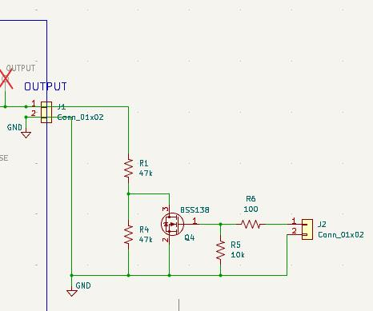
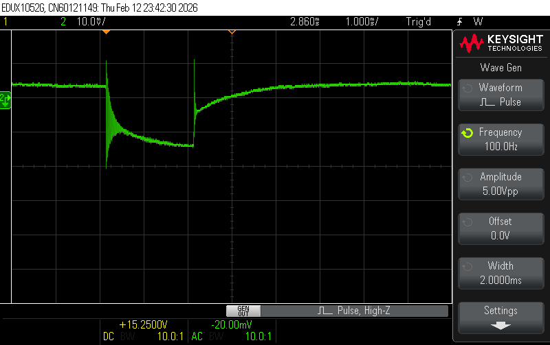

# Testing of LT3014 board

The board works OK more or less as designed.
 (new items added at bottom)

ECOs:
* Need to install R13, R14 as 100 ohms and C10 as 1uf for stability
* C4 and C5 need to be rated for > 60V (prototype built with 10V parts)

## 2025-06-02

The main issue is time to switch on and off may be slow for use in the
system if we want to change voltage dynamically.

With the default values, there is a resistive load of 210k (R9, R10)
in parallel with the voltage adjust resistor chain (about 2.5M).
There is an output capaictor (C5) of 1.0uF on the LT3014 output.

See [no_load.png](no_load.png).  Rise and fall times are about 2ms.

The fall time is dependent on the load resistor.  Here are some
measurements taken with 50V caps installed at C4, C5 and the supply
voltage reduced to 50V.  Note that R9 was disconnected, so the only
built-in load is the 2.5M adjust chain.  Voltage swing is from 46 to
36V.

| Load R | Equivalent R | 10V fall time     |              |
|--------|--------------|-------------------|--------------|
|        |              | <b>C5 = 1.0uF</b> | <b>4.7uF</b> |
| 500k   | 420k         | 9.2ms             | 16.6ms       |
| 1M     | 715k         | 15ms              |              |
| 2.5M   | 2.5M         | 47ms              | 85ms         |

If the time constant were due only discharge of C5 through the load
resistor, we would expect a much longer time constant.  For example
for the 420k case to dischage 1.0uF by 10V should take 85ms.

So my theory is that there is feedback in U1 which drains the output
capacitor.

Let's try changing C5 to a larger value.  Updated the table above.
Interestingly, not a factor of 4.7.  So this supports the theory that
it is not just the R-C of output capacitor and load.

## 2025-06-11

Change R9 to 512k and R10 to 24k to decrease load from voltage sense.
(also change C5 back to 1.0uF 50V).  Power supply at 50V.
Looks OK with about 5% error.

Also rise time is ~3ms (R-C curve) and fall time is 10ms (ramp)
for a 10V step.

| R9   | DPOT | V_MON | Multimeter | VSENSE TP | ERR PCT |
|------|------|-------|------------|-----------|---------|
| 510k | 0    | 29.6  | 31.2       | 1.40      | -5%     |
|      | 256  | 33.6  | 35.5       | 1.59      | -5%     |
|      | 512  | 38.9  | 41.1       | 1.85      | -5%     |
|      | 768  | 46.1  | 49.1       | 2.21      | -6%     |
|      |      |       |            |           |         |

## 2026-02-12

Studying load regulation.  Add a little MOSFET switch
to change the load (at 60V) from 640uA to 1.3mA.
This is similar to a large SiPM signal.

Here's a plot of the voltage at the output.
 __NOTE__ Scope AC-coupling with a time constant
of ~15ms (according to the internet) used.

## 2026-02-18

Add 150 ohms in series with 680nF on output to simulate
all the SiPM filter networks in series.
