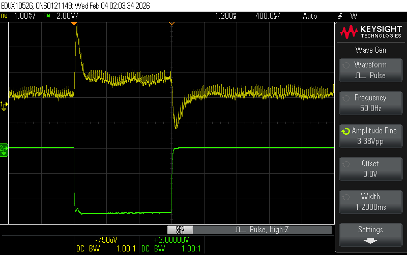
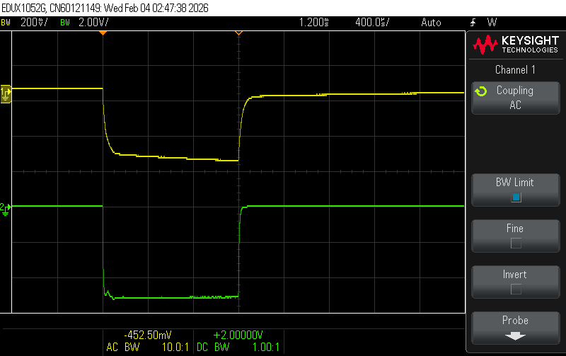
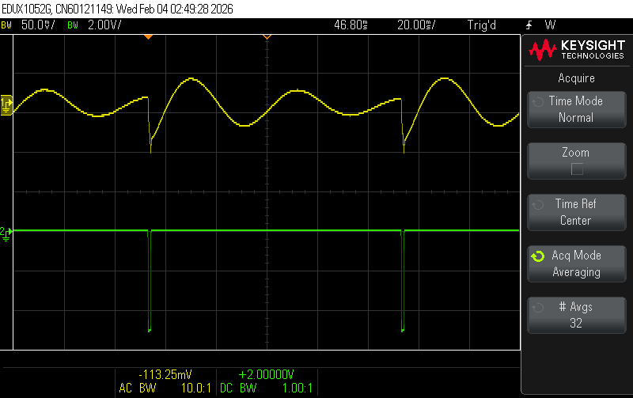
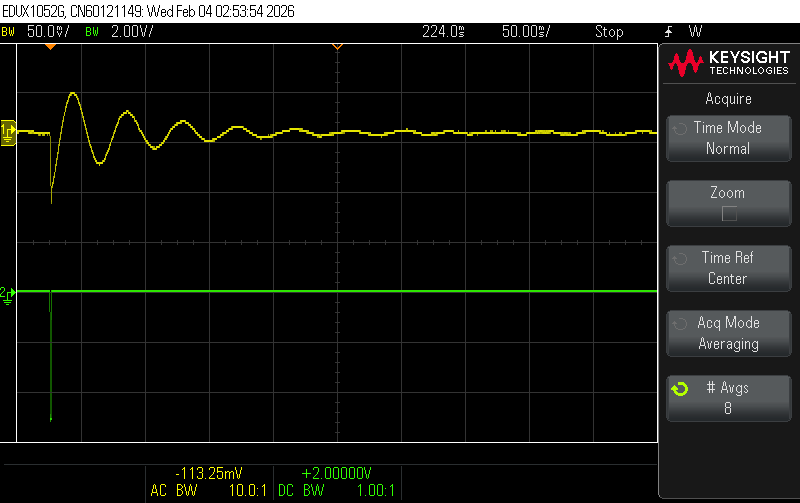

**2026-02-03**

Crosstalk tests.  Channels 1-4 change TIA feeback cap from 1000pF to
470pF to eliminate 50MHz oscillations.  

Pulse red LED through 330 ohms into S13360-3050PE (ch 2) at 50Hz for
1.2ms at 3.38V amplitude (adjusted to give 5V on ch 2).
 Bias set at 56V.

 View signal on S13360-3025PE (ch 1)
 Observe bipolar crosstalk peaks of ~100uS but <1mV during body of pulse

Scope set to average 32 traces with BWL enabled.

Looking at V(bias).

First is bias on pulsed SiPM. 

Next is main bias rail with pulser reset to 10Hz.

Same thing with pulse rate reduced to 1Hz.  Obviously there is a bit
of low-frequency ringing going on.

Note that looking at the raw boost converter (U4-1) there is no perturbation,
and the output of U4 (pin 5) looks the same as above (they are connected
together through copper).

So there is a perturbation on entire bias network of around 100mV peak-to-peak
when a large signal is generated on one SiPM.
